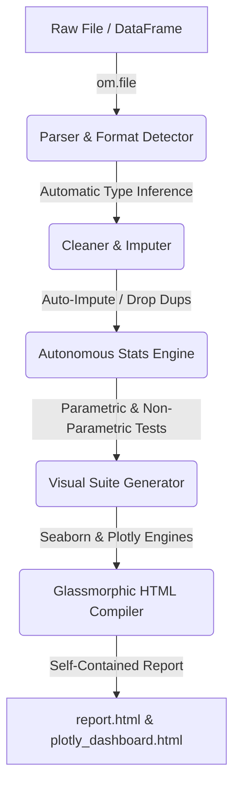

# 🚀 tom-analytics — One-Line Autonomous Data Analytics & EDA Library

[](https://pypi.org/project/tom-analytics/)
[](https://opensource.org/licenses/MIT)
[]()
[]()

`tom` (published as **`tom-analytics`**) is a zero-configuration, single-line automated exploratory data analysis (EDA) and diagnostics engine. Designed for developers, data scientists, and analysts, it handles everything from automatic file loading to sophisticated statistical tests, interactive Plotly visualizations, and premium glassmorphism HTML reports—all from a **single function call**.

---

## 🗺️ How it Works (Under the Hood)

The library is designed to go from raw file to interactive, publication-ready report in one line. Here is the operational workflow:



---

## ✨ Features & Capabilities

* 📂 **Universal File Parser (`om.file`)**: Delimiter-independent parser supporting CSV, TSV, JSON, Excel, and Parquet. Features interactive path prompt and string-matching path suggestions.
* 🧹 **Autonomous Preprocessing (`om.clean_report`)**: Intelligent type coercion (dates, numerical objects), median/mode missing value imputation, automatic column pruning (drops column with $>50\%$ missing values), and duplicate row filtering.
* 📊 **Multi-faceted Statistical Engine**: Computes high-fidelity parametric/non-parametric metrics, Shapiro-Wilk normality tests (dynamically capped up to a 5k sample limit), Chi-Square tests for category associations, and ANOVA tests for continuous-categorical relationships.
* 🎨 **Vibrant Visualizations Suite**: High-res static plots (ECDF, Q-Q, violin, box plots, histograms, pairplots, missing value heatmaps) at 300 DPI alongside a fully interactive pan/zoom Plotly dashboard.
* 💡 **NLP Insights Generation**: Natural language insights identifying multicollinearity, high-cardinality, data skewness warnings, and non-normality logs.
* 🪟 **Glassmorphic HTML Compiler**: Renders a premium, self-contained, completely portable HTML dashboard (`./tom_report/report.html`) utilizing elegant card spacing, backdrop blurs, dark purple-to-blue gradients, and collapsible diagnostic panels.
* 🖥️ **Windows CP1252 Fixes Out-of-the-Box**: Process-level `sys.stdout` and `sys.stderr` are automatically reconfigured to UTF-8 to prevent any Windows encoding crashes when displaying terminal emojis.

---

## 🛠️ Installation

You can install the package directly from PyPI or locally in editable mode.

### Option A: Install from PyPI (Recommended)
```bash
pip install tom-analytics
```

### Option B: Local Developer Installation (Editable Mode)
1. Clone your repository:
   ```bash
   git clone https://github.com/OmkarSugave/tom.git
   cd tom
   ```
2. Activate your virtual environment and install:
   ```bash
   # Windows PowerShell
   .\venv\Scripts\Activate.ps1
   pip install -e .
   ```

---

## 🚀 Quickstart & Essential API Reference

Import `tom` as `om` and unleash automated EDA immediately:

```python
import tom as om

# 1. Load your dataset (automatically handles format & paths)
om.file("mock_data.csv")

# 2. Run the complete autonomous pipeline!
om.describe()
```

---

## 📖 Deep API Reference

### 1. File Loading & Parse: `om.file(path=None)`
Loads any tabular dataset. If no path is provided, it opens an interactive terminal dialogue.
```python
# Direct path loading
om.file("dataset.parquet")

# Delimiter, type, and encoding detection are completely autonomous.
# If you make a typo, tom will suggest the nearest file name!
```

### 2. Auto-Cleaning: `om.clean_report(df=None)`
Runs and prints a detailed analysis of missing data, data types, duplicate rows, and imputed actions.
```python
om.clean_report()
```

### 3. Outlier Analysis: `om.outliers(df=None)`
Runs an IQR-based boundary analysis across all numerical features, displaying lower/upper limits, min/max outliers, and percentages.
```python
om.outliers()
```

### 4. Association & Correlation: `om.correlation(df=None)`
Calculates the Pearson correlation matrix for numerical features. Saves a publication-quality heatmap at `./tom_report/charts/single_correlation_heatmap.png` and prints a formatted terminal table.
```python
om.correlation()
```

### 5. Automated Machine Learning Guide: `om.suggest(df=None)`
Analyzes dataset dimensions, distribution, and types to recommend a classification or regression pipeline. Suggests the best-suited machine learning models (e.g., Random Forests, XGBoost, Ridge) and lists essential preprocessing rules.
```python
om.suggest()
```

### 6. Side-by-Side Comparison: `om.compare(df2, df1=None)`
Compares two DataFrames (e.g., training vs. test, or original vs. cleaned) showing shapes, missing values, duplicates, and column overlaps.
```python
import pandas as pd
df_test = pd.read_csv("test_dataset.csv")

om.compare(df_test)
```

### 7. Exporting Reports: `om.export(format_type="pdf")`
Exports your gorgeous glassmorphic HTML report into a standard PDF page.
```python
om.export("pdf")
```
*Note: PDF export utilizes `pdfkit` (requires `wkhtmltopdf` on your system path).*

---

## 📁 Package Architecture & Directory Structures

The codebase is highly modularized, clean, and extensible:

```text
tom/
├── tom/
│   ├── __init__.py      # Global UTF-8 reconfiguration, state manager, and public API
│   ├── loader.py        # Autonomous format parses (CSV, TSV, Parquet, JSON, Excel)
│   ├── cleaner.py       # Imputers, duplicate drops, type inference engine
│   ├── stats.py         # Shapiro-Wilk, ANOVA, Chi-Square association engine
│   ├── charts.py        # 300 DPI Seaborn plots + base64 image compiler
│   ├── insights.py      # NLP-driven analytics alerts & warning rules
│   ├── reporter.py      # Glassmorphic HTML template builder & Plotly compiler
│   └── utils.py         # Directory checkers, path string metrics
├── pyproject.toml       # Build metadata & dependency declarations
├── requirements.txt     # Standard pip freeze
├── README.md            # Comprehensive documentation (this file)
└── tom_report/          # Generated output folder (auto-excluded in .gitignore)
    ├── report.html      # Premium portable HTML report
    └── charts/
        └── plotly_dashboard.html  # Interactive pan & zoom dashboard
```

---

## 🔒 License
This project is licensed under the **MIT License** - see the LICENSE file for details.
